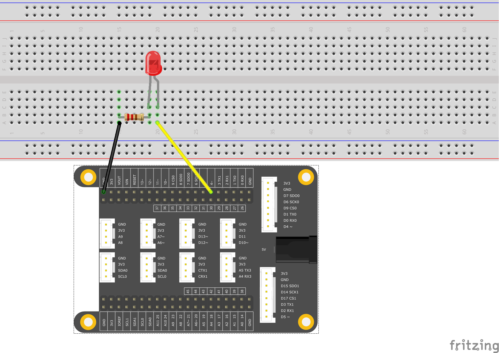

# PWMBrightnessControl


In this project, let's try to control the brightness of LED - light gradually on and off LED.

You will use PWM to set on-off ratio of output signal to get different voltage. The pins marked with “~“ can be used for this.

## What you need 

* SwiftIO board 
* LED 
* 330ohm resistor 
* Breadboard 
* Jumper wires

## Circuit

<<<<<<< HEAD
## <span style="color:#EA5823;font-weight:700">Circuit</span>


=======

>>>>>>> 7bae31b20d3d376f9b3f177cbedec9d0dc45ac92

Build the circuit as shown above.

* The anode \(positive leg\) of LED goes to PWM0A through resistor.
* The cathode \(negative leg\) of LED connects to ground.

## Code

You can find the example code at the bottom left corner of IDE:  &gt; GettingStarted &gt; PWMBrightnessControl.

```swift
// Brighten or dimming the LED by changing the duty cycle of PWM signal.

// Import the library to enable everything in it, like relevant classes and methods. 
// This is first step for your coding process.
import SwiftIO

// Initialize the pin PWM0A as output.
let led = PWMOut(Id.PWM0A)

// Initialize a variable to store the value of duty cycle. 
// It should be a float between 0.0 and 1.0.
var value: Float = 0.0

// In the loop, the code will run over and over again.
// Change the brightness from on to off and off to on all the time.
while true {
    // Brighten the LED in two seconds. 
    // Increase the duty cycle from 0.0 to 1.0.
    // The value should be changed little by little to ensure a smooth brightness change.
    while value <= 1.0 {
        led.setDutycycle(value)
        sleep(ms: 20)
        value += 0.01
    }
    // Keep the duty cycle between 0.0 and 1.0.
    value = 1.0

    // Decrease the value from 1.0 to 0.0 to dim the LED.
    while value >= 0 {
        led.setDutycycle(value)
        sleep(ms: 20)
        value -= 0.01
    }
    // Keep the duty cycle between 0.0 and 1.0.
    value = 0.0
}

```

## Instruction

### What is Pulse Width Modulation \(PWM\)?

Pulse Width Modulation \(PWM\) can simulate analog results digitally. Digital control is used to create a square wave, a signal that switches between on and off. By changing the ratio of the on-time to the off-time, it will simulate the voltage between fully open \(3.3 volts\) and off \(0 volts\). The duration of the "on-time" is called the pulse width. To obtain a varying analog value, you can change or modulate the pulse width. For example, if you repeat this switching pattern with LEDs fast enough, the result is as if the signal is a stable voltage between 0 and 3.3v that controls the brightness of the LED.

A fixed time period is consists of on and off time. The duration or period is the inverse of the PWM frequency. In other words, when the PWM frequency is about 500 Hz, one period are measured for 2 milliseconds each. 

The duty cycle is the percentage of on time of output signal during one period. The range of calling `setDutycycle(value)` is 0-1, so `setDutycycle(1)` requests a 100% duty cycle \(always on\), and `setDutycycle(0.5)` is a 50% duty cycle \(half the time\).


### About code

You may notice the pin name of PWM are a little strange, with "A" or "B" after the number. Since there are 14 pins for PWM in total, some pins are paired, like PWM3A and PWM3B. Two paired pin can only share the same frequency. So check the `Id` enumeration [here](https://swiftioapi.madmachine.io/Enums/Id.html).

`var` is keyword to declare variable. Just like its name, its value can always change after it has been assigned. The value is a float number, since it is used as duty cycle to set output.

In the loop `while true`, the first `while` loop is to ensure the value not bigger than 1.0 and brighten the LED. Each time, you will gradually increase the value by 0.01. The brightening process lasts for 2 minutes. To ensure a smooth brightness change, you need to set appropriate value change and sleep time. The second while is similar but to dim the LED. 

After finished first loop, the value is about 1.01. So `value = 1.0` and `value = 0.0`is to keep the it in the specified range.

## See Also

* [Id](https://swiftioapi.madmachine.io/Enums/Id.html) - Enumerations of all the pins on the board.
* ​[PWMOut](https://swiftioapi.madmachine.io/Classes/PWMOut.html) - The PWMOut class is used to change the time of high voltage during one period to simulate different output. 

## References

* ​[wiki: Pulse-width modulation](https://en.wikipedia.org/wiki/Pulse-width_modulation)​
* ​[wiki: Duty cycle](https://en.wikipedia.org/wiki/Duty_cycle)​

