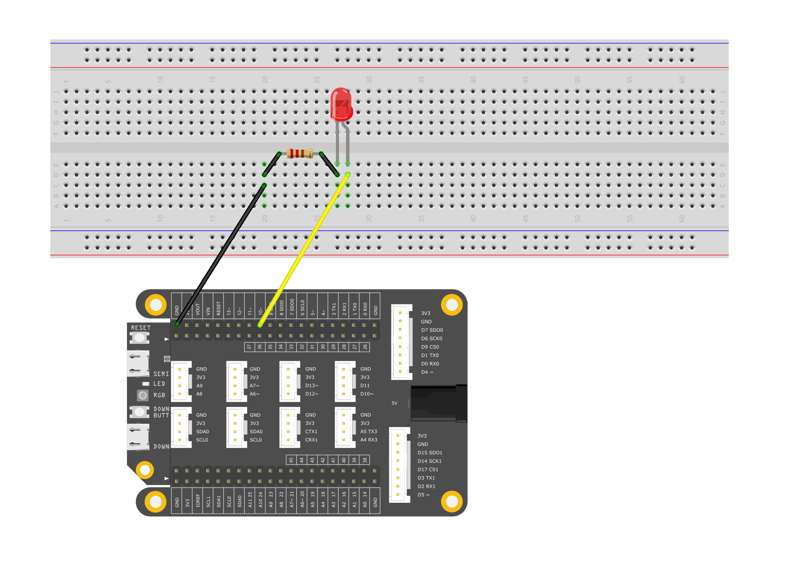
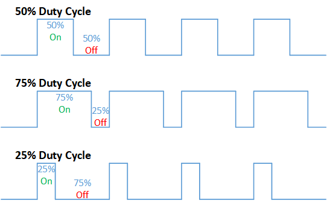

# <span style="color:#EA5823;font-weight:800">PWMBrightnessControl</span>


In this project, let's try to control the brightness of LED - light gradually on and off LED.

You will use PWM to set on-off ratio of output signal to get different voltage. The pins marked with “~“ can be used for this.

## <span style="color:#EA5823;font-weight:700">What you need</span>

- SwiftIO board 
- LED 
- 330ohm resistor 
- breadboard 
- wires

#### Kits that meet the experimental conditions: 
- [Maker Kit for SwiftIO](https://www.madmachine.io/product-page/maker-kit-for-swiftio)

## <span style="color:#EA5823;font-weight:700">Circuit</span>



Build the circuit as shown above.

* The anode \(positive leg\) of LED goes to PWM0A through resistor.
* The cathode \(negative leg\) of LED connects to ground.

## <span style="color:#EA5823;font-weight:700">Code</span>

You can find the example code at the bottom left corner of IDE:  &gt; GettingStarted &gt; PWMBrightnessControl.

```swift
// Brighten or dimming the LED by changing the duty cycle of PWM signal.

// Import the library to enable everything in it, like relevant classes and methods. 
// This is first step for your coding process.
import SwiftIO

// Initialize the pin PWM0A as output.
let led = PWMOut(Id.PWM2B)

// Initialize a variable to store the value of duty cycle. 
// It should be a float between 0.0 and 1.0.
var value: Float = 0.0

// In the loop, the code will run over and over again.
// Change the brightness from on to off and off to on all the time.
while true {
    // Brighten the LED in two seconds. 
    // Increase the duty cycle from 0.0 to 1.0.
    // The value should be changed little by little to ensure a smooth brightness change.
    while value <= 1.0 {
        led.setDutycycle(value)
        sleep(ms: 20)
        value += 0.01
    }
    // Keep the duty cycle between 0.0 and 1.0.
    value = 1.0

    // Decrease the value from 1.0 to 0.0 to dim the LED.
    while value >= 0 {
        led.setDutycycle(value)
        sleep(ms: 20)
        value -= 0.01
    }
    // Keep the duty cycle between 0.0 and 1.0.
    value = 0.0
}

```

## <span style="color:#EA5823;font-weight:700">Instruction</span>
Pulse Width Modulation (PWM) is a technique for obtaining analog results digitally. Digital control is used to create a square wave, a signal that switches between on and off. By changing the ratio of the signal on time to the signal off time, this switch mode can simulate the voltage between fully open (3.3 volts) and off (0 volts). The duration of the "on time" is called the pulse width. To obtain a varying analog value, you can change or modulate the pulse width. For example, if you repeat this switching pattern with LEDs fast enough, the result is as if the signal is a stable voltage between 0 and 3.3v that controls the brightness of the LED. 

In the figure below, the red line represents a fixed time period. The duration or period is the inverse of the PWM frequency. In other words, when the PWM frequency is about 500 Hz, the red lines are measured for 2 milliseconds each. The range of calling setDutycycle(value) is 0-1, so setDutycycle(1) requests a 100% duty cycle (always on), and setDutycycle(0.5) is a 50% duty cycle (half the time).



The `PWMOut` class is used to vary the output voltage by controlling the duration of high output in the time periodCycles on the pin. The PWM pins with same number are paired, like PWM3A and PWM3B. They can only share the same frequency. PWM0A, PWM1A, PWM2B, PWM2A, PWM3B, PWM3A, PWM4A, PWM5A, PWM6A, PWM6B, PWM7A, PWM7B, PWM8A, PWM8B. `.setDutycycle()`Set the frequency and the dutycycle of a PWM output signal. The value of the dutycycle should be a float between 0.0 and 1.0.

## <span style="color:#EA5823;font-weight:700">See Also</span>

- [Id](https://swiftioapi.madmachine.io/Enums/Id.html) - Enumerations, public enum Id : UInt32
- [AnalogIn.readRawValue()](https://swiftioapi.madmachine.io/Classes/AnalogIn.html#/s:7SwiftIO8AnalogInC12readRawValueSiyF) - Read the current raw value from the specified analog pin.

## <span style="color:#EA5823;font-weight:700">References</span>

- [Pulse-width modulation](https://en.wikipedia.org/wiki/Pulse-width_modulation)
- [Duty cycle](https://en.wikipedia.org/wiki/Duty_cycle)
- [Potentiometer](https://en.wikipedia.org/wiki/Potentiometer)
- [Voltage divider](https://en.wikipedia.org/wiki/Voltage_divider)


---
Last revision 2020/09/04 by Johnson
