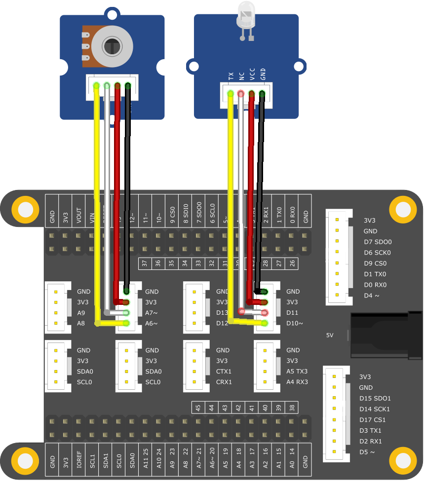

# <span style="color:#EA5823;font-weight:800">BrightnessAnalogIn</span>


In this example, we use an analog output (pulse width modulation, PWM) to adjust the brightness of an LED based on the position of the potentiometer. 

PWM is a technology that obtains a very similar behavior from a digital output, which can be turned off and on very quickly, and the ratio between on and off time is different.

## <span style="color:#EA5823;font-weight:700">What you need</span>

- SwiftIO board
- Jumper wires
- Potentiometer or Module
- LED Module (or a LED light and a 10k ohm resistor)
- SwiftIO shield(optional)

#### Kits that meet the experimental conditions: 
- [Maker Kit for SwiftIO](https://www.madmachine.io/product-page/maker-kit-for-swiftio)

## <span style="color:#EA5823;font-weight:700">Circuit</span>


## <span style="color:#EA5823;font-weight:700">Code</span>

```swift
// Read the analog input value and use it to set the PWM output in order to change the LED brightness.

// Import the library to enable the relevant classes and functions.
import SwiftIO

// Initialize an analog input and a digital output pin the components are connected to.
let sensor = AnalogIn(Id.A6)
let led = PWMOut(Id.PWM2B)

// Allow the LED brightness control all the time.
while true {
    // Read the input voltage in percentage.
    let value = sensor.readPercent()
    // Light the LED by setting the duty cycle.
    led.setDutycycle(value)
    // Keep the current LED state for 200 millisecond.
    sleep(ms: 200)
}
```

## <span style="color:#EA5823;font-weight:700">Instruction</span>

### What is Pulse Width Modulation (PWM)?

Pulse Width Modulation (PWM) is a technique for obtaining analog results digitally. Digital control is used to create a square wave, a signal that switches between on and off. By changing the ratio of the signal on time to the signal off time, this switch mode can simulate the voltage between fully open (3.3 volts) and off (0 volts). The duration of the "on time" is called the pulse width. To obtain a varying analog value, you can change or modulate the pulse width. For example, if you repeat this switching pattern with LEDs fast enough, the result is as if the signal is a stable voltage between 0 and 3.3v that controls the brightness of the LED.

In the figure below, the red line represents a fixed time period. The duration or period is the inverse of the PWM frequency. In other words, when the PWM frequency is about 500 Hz, the red lines are measured for 2 milliseconds each. The range of calling `setDutycycle(value)` is 0-1, so `setDutycycle(1)` requests a 100% duty cycle (always on), and `setDutycycle(0.5)` is a 50% duty cycle (half the time).


Correspondingly, analogIn's `readRawValue()` is not called this time, but the corresponding return value range of readPercent() is 0 to 1.

### Experiment more
Once you get the example running, grab your SwiftIO board and shake it back and forth. What you are doing here is actually mapping time across the entire space. In our opinion, motion blurs each LED flashing into a line. As the LED fades in and out, the length of these thin lines will increase and decrease. Now you will see the pulse width.

### Why would PWM instead of traditional analog signal?

Unlike incandescent light bulbs, LEDs (and also some other devices) can only operate under certain voltage. Lowering the voltage on LEDs wouldn't result in a lower brightness, the LED will simply turn off if the voltage isn't high enough. 

However, we can use PWM to control the overall power output of the LEDs. Indeed is the LED flashing, but our eyes cannot react quick enough for it. So it efficiently trick our brain into thinking this LED is darker.

>Side note: most of the mobile phones use the same method to control the brightness of the screen. However, if the frequency of the flashing is too low (the screen is very dark), it may be harmful to your eyes. 


## <span style="color:#EA5823;font-weight:700">See Also</span>
- [PWMOut](https://swiftioapi.madmachine.io/Classes/PWMOut.html) - The PWMOut class is used to vary the output voltage

## <span style="color:#EA5823;font-weight:700">References</span>

- [wiki: Pulse-width modulation](https://en.wikipedia.org/wiki/Pulse-width_modulation)
- [wiki: Duty cycle](https://en.wikipedia.org/wiki/Duty_cycle)
- [wiki: Potentiometer](https://en.wikipedia.org/wiki/Potentiometer)
- [wiki: Voltage divider](https://en.wikipedia.org/wiki/Voltage_divider)

## Tips




---
## Version History
Last Edit 2020/09/13 by Martin

> edits on Instruction
>
> add why we need pwm
>
> edit link tags

Last revision 2020/09/12 by Johnson